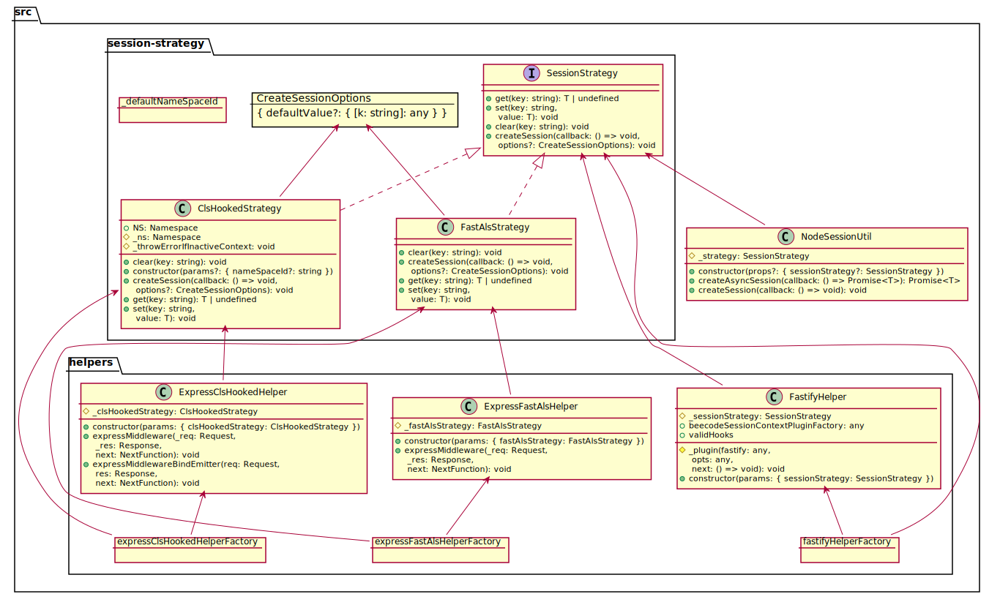

[](https://beecode.semaphoreci.com/projects/msh-node-session)
[](https://codecov.io/gh/beecode-rs/msh-node-session)
[](https://github.com/beecode-rs/msh-node-session/blob/main/LICENSE)  
[](https://nodei.co/npm/@beecode/msh-node-session)

# msh-node-session

Micro-service helper: node error

This project is intended to be used in typescript project.

<!-- toc -->

- [Install](#install)
- [Diagram](#diagram)
- [Usage](#usage)

<!-- tocstop -->

## Install

`npm i @beecode/msh-node-session`

## Diagram



## Usage

### Util implementation example

#### Class extension

```typescript
// src/util/session-util.ts

import { NodeSessionUtil } from '@beecode/msh-node-session/lib/node-session-util.js'
import { FastAlsStrategy } from '@beecode/msh-node-session/lib/session-strategy/fast-als-strategy.js'
// import { ClsHookedStrategy } from '@beecode/msh-node-session/lib/session-strategy/cls-hooked-strategy.js'
import { SessionStrategy } from '@beecode/msh-node-session/lib/session-strategy/session-strategy.js'
import { cacheUtil } from '@beecode/msh-node-util/lib/cache-util.js'

export enum SessionData {
  TYPEORM_ENTITY_MANAGER = 'typeorm-entity-manager',
  AUTH_USER = 'auth-user',
}

export class SessionUtil extends NodeSessionUtil {

  public constructor(params?: { sessionStrategy?: SessionStrategy }) {
    const { sessionStrategy } = params ?? {}
    super({ sessionStrategy })
  }

  public getTransactionManager(): EntityManager | undefined {
    try {
      return this._strategy.get<EntityManager>(SessionData.TYPEORM_ENTITY_MANAGER)
    } catch (_err) {
      return undefined
    }
  }

  protected _setTransactionManager(entityManager: EntityManager): void {
    return this._strategy.set<EntityManager>(SessionData.TYPEORM_ENTITY_MANAGER, entityManager)
  }
  
  public async startTransaction<T>(callback: (transactionEntityManager: EntityManager) => Promise<T>): Promise<T> {
    return this.createAsyncSession(() => {
      const existingTransactionManager = this.getTransactionManager()
      if (existingTransactionManager) return callback(existingTransactionManager)
      return databaseService.getConnection().transaction<T>((newTransEntityManager: EntityManager) => {
        this._setTransactionManager(newTransEntityManager)
        return callback(newTransEntityManager)
      })
    })
  }

  public setAuthUser(authUser: JWTPayloadUser): void {
    this._strategy.set<JWTPayloadUser>(SessionData.AUTH_USER, authUser)
  }

  public getAuthUser(): JWTPayloadUser {
    const authUser = this._strategy.get<JWTPayloadUser>(SessionData.AUTH_USER)
    if (!authUser) throw error.server.internalServerError('Missing auth user from session')
    return authUser
  }

  /**
   * Connect to existing transaction, this is only used in migrations files
   * @param {EntityManager} entityManager
   * @param {() => Promise<T>} callback
   * @returns {Promise<T>}
   */
  public async entityManagerSideCall<T>(entityManager: EntityManager, callback: () => Promise<T>): Promise<T> {
    return this.createAsyncSession(async () => {
      this._setTransactionManager(entityManager)
      return callback()
    })
  }
}

export const sessionStrategy = new FastAlsStrategy()
// export const sessionStrategy = new ClsHookedStrategy()
export const sessionUtil = cacheUtil.singleton(() => new SessionUtil({ sessionStrategy }))

```

### Fastify middleware example

```typescript
import Fastify from 'fastify'
import { fastifyHelperFactory } from '@beecode/msh-node-session/lib/helpers/fastify-helper.js'
import { sessionStrategy } from 'src/util/session-util'


const fastify = Fastify()

const fastifyHelper = fastifyHelperFactory({sessionStrategy})

await fastify.register(fastifyHelper.beecodeSessionContextPluginFactory())

```

### Express middleware example

#### FastAls

```typescript
import express from 'express'
import { expressFastAlsHelperFactory } from '@beecode/msh-node-session/lib/helpers/express-fast-als-helper.js'
import { sessionStrategy } from 'src/util/session-util'

const expressApp = express()

const expressFastAlsHelper = expressFastAlsHelperFactory({fastAlsStrategy:sessionStrategy})
this._expressApp.use((req, res, next) => expressFastAlsHelper.expressMiddleware(req, res, next))
// other middlewares
// expressApp.use(... 
```

#### ClsHooked

```typescript
import express from 'express'
import { expressClsHookedHelperFactory } from '@beecode/msh-node-session/lib/helpers/express-cls-hooked-helper.js'
import { sessionStrategy } from 'src/util/session-util'

const expressApp = express()

const expressClsHookedHelperHelper = expressClsHookedHelperFactory({fastAlsStrategy:sessionStrategy})
this._expressApp.use((req, res, next) => expressClsHookedHelperHelper.expressMiddleware(req, res, next))
this._expressApp.use((req, res, next) => expressClsHookedHelperHelper.expressMiddlewareBindEmitter(req, res, next))
// other middlewares
// expressApp.use(... 
```
